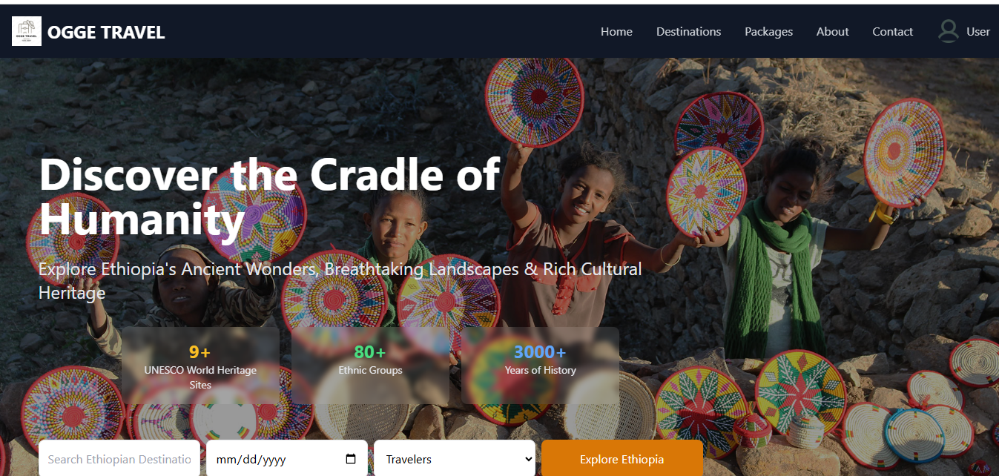

🌍 Ogge Travel Agency Web App
A modern, responsive web application for managing travel packages and user bookings. Ogge Travel offers users an intuitive way to explore destinations, book packages, and manage their travel history — all in one seamless interface.

Built using PHP, MySQL, Tailwind CSS, JavaScript, and HTML, the app is powered locally using XAMPP for easy development and testing.

✨ Features
🔐 User Authentication (Login & Registration)
📦 Travel Package Booking
👤 User Profile Management
📩 Contact Form
📱 Responsive Design with Tailwind CSS
🕘 View Booking History
🛠️ Admin Dashboard (Coming Soon)
🗺️ Destination Listings (Coming Soon)

🛠️ System Requirements
Local Server
XAMPP (includes Apache, MySQL, PHP)
PHP 7.4 or higher
MySQL 5.7 or higher
Composer (for managing PHP dependencies)
Node.js & npm (for Tailwind CSS build process)

PHP Extensions
PDO, mysqli, GD Library, cURL

🚀 Technologies Used
PHP – Server-side scripting
MySQL – Database management
Tailwind CSS – Utility-first CSS framework for responsive design
JavaScript – Client-side interactivity
XAMPP – Local development environment (Apache, MySQL, PHP, and more)

📌 Project Name
Ogge – Your next adventure starts here.

