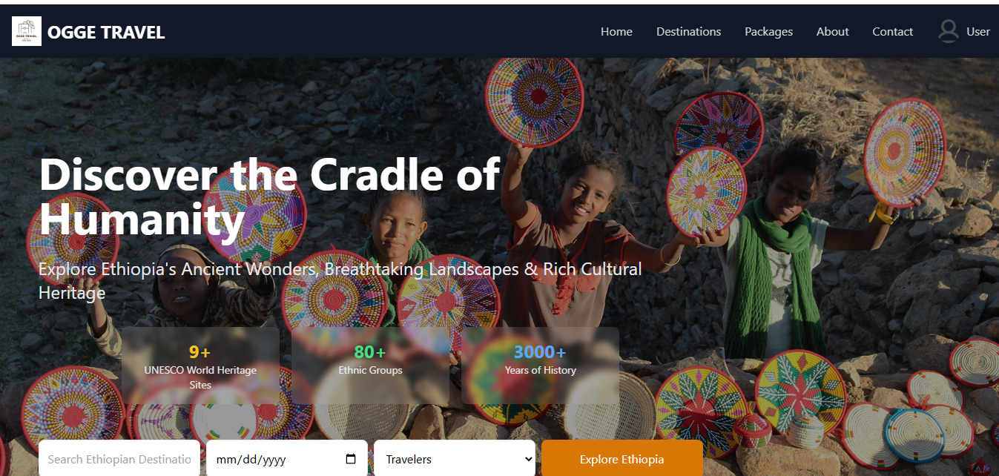

# 🌍 OGGE Travel — The Curated Escape
**Professional Luxury Concierge & Travel Management Platform**



OGGE Travel is a premium, full-stack travel concierge platform designed to showcase Ethiopia's heritage while providing a seamless booking and management experience. Built with a focus on "Luxury Concierge" aesthetics, it features a high-performance user interface and a comprehensive, data-driven admin command center.

---

## 🚀 Key Features

### 💎 For Travelers (User Side)
- **Luxury Hero Experience**: Immersive, responsive hero section with high-quality visual storytelling.
- **Heritage Exploration**: Discover destinations like Lalibela, Aksum, and the Simien Mountains with detailed cultural context.
- **Smart Booking System**: Direct package booking with real-time price calculation and profile-linked history.
- **Community Journals**: A space for travelers to share stories and photos of their "Curated Escapes."
- **User Dashboards**: Manage bookings, track trip statuses, and personalize profiles.
- **Responsive Design**: Pixel-perfect experience across Mobile, Tablet, and Desktop.

### 🛠️ For Administrators (Admin Command Center)
- **Interactive Dashboard**: Real-time stats with dynamic **Chart.js** visualizations for revenue trends and booking status.
- **Full CRUD Modules**: Complete management of Destinations, Travel Packages, and Blog content.
- **Operational Control**: 
    - **Bookings**: Confirm, cancel, or track travel requests.
    - **Users**: Manage accounts and promote/demote administrator roles.
    - **Messages**: Dedicated inbox for private enquiries with "read/unread" tracking.
    - **Reviews**: Moderate user feedback and star ratings.
- **Data Export**: One-click **CSV Export** for booking reports and newsletter subscribers.
- **Security**: Robust RBAC (Role-Based Access Control) middleware to protect sensitive data.

---

## 💻 Tech Stack

- **Backend**: PHP 8.0+ (Procedural & Structured)
- **Database**: MySQL (relational schema with 10+ optimized tables)
- **Frontend UI**: Tailwind CSS (Utility-first, modern aesthetics)
- **Interactive Layers**: Vanilla JavaScript + Chart.js (Data visualization)
- **Authentication**: Hardened session-based auth with CSRF tokens, login throttling, secure password hashing, and reset tokens

---

## 📦 Installation & Setup

1. **Clone the Repository**:
   ```bash
   git clone https://github.com/yourusername/Ogge-Travel.git
   cd Ogge-Travel
   ```

2. **Database Configuration**:
   - Create a new database named `travel_agency` in your MySQL environment (e.g., XAMPP/WAMP).
   - Import the SQL schema located in `/Database/travel_agency.sql`.
   - Configure database credentials. If you see `Service temporarily unavailable. Please try again later.`, PHP could not connect to MySQL with the configured credentials.
   - Option A: copy `includes/config.example.php` to `includes/config.php` and fill in your real host, username, password, and database name. `includes/config.php` is ignored by Git so secrets stay local to the server.
     ```bash
     cp includes/config.example.php includes/config.php
     ```
   - Option B: use environment variables (works well on VPS/local shells):
     ```bash
     export OGGE_DB_HOST=localhost
     export OGGE_DB_USER=root
     export OGGE_DB_PASSWORD=''
     export OGGE_DB_NAME=travel_agency
     ```

3. **Run Locally**:
   - Use a local PHP server:
     ```bash
     php -S localhost:8000
     ```
   - Navigate to `http://localhost:8000` in your browser.

---

## 🔑 Admin Credentials
- **URL**: `http://localhost:8000/admin/`
- **Email**: `eshetufeleke21@gmail.com`
- **Password**: `ChangeMe123` *(demo seed only; change after first login)*

---

## 📸 Screenshots

| Dashboard | Destinations |
|---|---|
|  |  |

---

## 🤝 Contributing
Contributions are welcome! If you'd like to improve the UI or add new modules:
1. Fork the Project.
2. Create your Feature Branch (`git checkout -b feature/AmazingFeature`).
3. Commit your Changes (`git commit -m 'Add some AmazingFeature'`).
4. Push to the Branch (`git push origin feature/AmazingFeature`).
5. Open a Pull Request.

---

## 📄 License
Distributed under the MIT License. See `LICENSE` for more information.

**Built with ❤️ for OGGE Travel**
